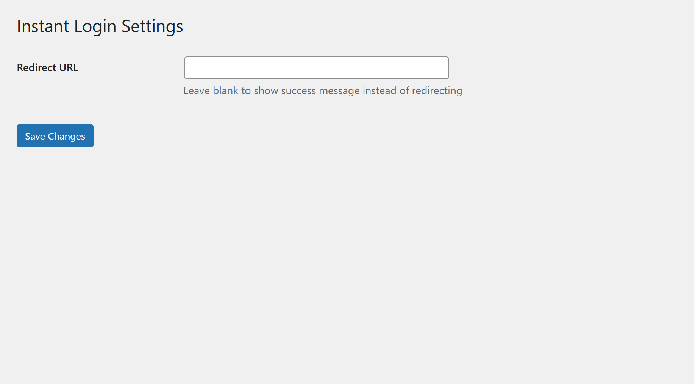

# Instant Login WordPress Plugin

A lightweight WordPress plugin that creates a custom login page with AJAX validation and optional redirect.

## Features ✨
- Auto-creates login page on activation
- Smooth AJAX form submission with loading spinner
- Customizable success/error messages
- Optional redirect after successful login
- Clean, responsive design
- Easy-to-use settings page
- Continuous integration checks for code quality
- Secure nonce verification and input sanitization

## Installation 🚀
1. Download the [latest release](https://github.com/Awais-857/instant-login/releases)
2. Upload to `/wp-content/plugins/` via WordPress admin
3. Activate the plugin
4. Visit `yoursite.com/login` to see your new login page

## Configuration ⚙️
1. Go to **Settings → Instant Login**
2. Set a redirect URL (or leave blank for success messages)
3. Save changes

## Customization 🎨
- **Logo/Header**: Edit `templates/custom-login-template.php`
- **Styling**: Modify `assets/css/style.css`
- **Behavior**: Edit `assets/js/script.js`
- **PHP Logic**: Modify `includes/class-instant-login.php`

## Requirements 📋
- WordPress 5.6+
- PHP 7.0+

## Continuous Integration 🔄
This plugin uses GitHub Actions for automated quality checks:

| Check | Status | Description |
|-------|--------|-------------|
| PHP Syntax |  | Validates all PHP files for syntax errors |
| WordPress Coding Standards |  | Ensures code follows WordPress best practices |

## Security 🔒
- Nonce verification on all AJAX requests
- Input sanitization
- Proper authorization checks
- Secure password handling via WordPress core functions

## License 📄
This plugin is licensed under the [MIT License](LICENSE).

## Contributing 🤝
Pull requests are welcome! Please:
1. Open an issue first to discuss changes
2. Follow [WordPress coding standards](https://developer.wordpress.org/coding-standards/)
3. Update tests as appropriate

## Support ❓
Found a bug or need help?  
[Open an Issue](https://github.com/Awais-857/instant-login/issues)

---
Created by [Awais Iqbal](https://github.com/Awais-857)
