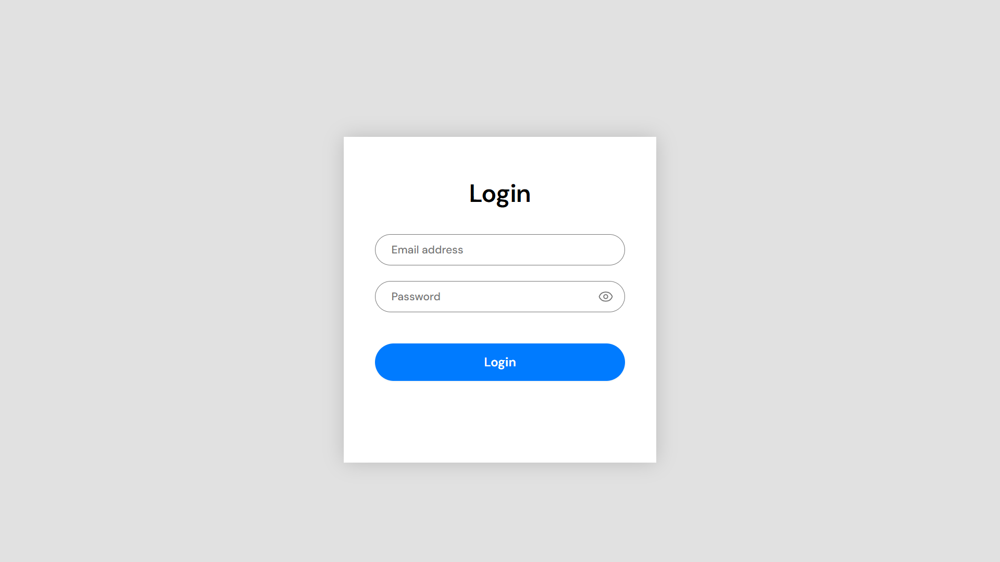

# Instant Login WordPress Plugin

A lightweight WordPress plugin that creates a custom login page with AJAX validation and optional redirect.

## Features ✨
- Auto-creates login page on activation
- Smooth AJAX form submission with loading spinner
- Customizable success/error messages
- Optional redirect after successful login
- Clean, responsive design
- Easy-to-use settings page

## Installation 🚀
1. Download the [latest release](https://github.com/Awais-857/instant-login/releases)
2. Upload to `/wp-content/plugins/` via WordPress admin
3. Activate the plugin
4. Visit `yoursite.com/login` to see your new login page

## Configuration ⚙️
1. Go to **Settings → Instant Login**
2. Set a redirect URL (or leave blank for success messages)
3. Save changes

## Customization 🎨
- **Logo/Header**: Edit `templates/custom-login-template.php`
- **Styling**: Modify `assets/css/style.css`
- **Behavior**: Edit `assets/js/script.js`

## Requirements 📋
- WordPress 5.0+
- PHP 7.0+

## License 📄
This plugin is licensed under the [MIT License](LICENSE).

## Support ❓
Found a bug or need help?  
[Open an Issue](https://github.com/Awais-857/instant-login/issues)

## Contributing 🤝
Pull requests are welcome! Please see:
- [Contributing Guidelines](CONTRIBUTING.md)
- [Code of Conduct](CODE_OF_CONDUCT.md)

Please open an issue first to discuss changes.

---
Created by [Awais Iqbal](https://github.com/Awais-857)
